### Homework 2 (due Sunday, September 18, 2016)

**This homework has two parts:** complete the [in-class sketches](../README.md#recreating-sketches) and submit them in your homework repository (label these sketches `inclass-1.js` etc.); below, complete the programming practice problems by **Sunday night**.

#### Programming Practice (due Sunday)

- **Assignment: Pick 5 of the 15 sketches below and recreate them; at least one must be animated.** Bonus points for adding flourishes to your sketches. Create a new repository for this asignment, and then create a new file for each of your five sketches -- include the sketch number in the file name. Email a link to your repository [to us](mailto:jzamfirescupereira@cca.edu,mshiloh@cca.edu) by **Sunday, September 18**.

- Not all these sketches are equally difficult -- in fact some are very challenging!

- You may find the following [Processing tutorials](https://processing.org/tutorials/) helpful, but keep in mind the examples won't run exactly as written -- we're using JavaScript in P5.js, whereas Processing uses Java. (There's a guide for converting between the two [here](https://github.com/processing/p5.js/wiki/Processing-transition) -- but in general, any variable types (e.g., `int`, `float`) can be replaced with `var`, except for function paramters, which don't need the `var`, and function definitions use `function` in place of `void`.
  - The [Processing Overview](https://processing.org/tutorials/overview)
  - [Coordinate System and Shapes](https://processing.org/tutorials/drawing)
  - [Color](https://processing.org/tutorials/color)

- It may also help to read through the [P5.js reference](http://p5js.org/reference/) to understand all the various functions available to you.

- For extra programming help, consider following the [Khan Academy programming tutorials using Processing](https://www.khanacademy.org/computing/computer-programming/programming) -- but again, remember that we are using P5.js, not Processing, and your code won't look exactly the same.

- For hands-on, in-person help, stop by the Hybrid Lab and speak with a lab monitor, or make an appointment with one of the [Software or Math/Science coaches at the Learning Resources Center](https://www.cca.edu/students/resources/appointments).

Without further ado, here are the sketches:

1. Circles in a diagonal line. Use a while loop to draw the balls in sequence. What do you know about the x and y coordinates of each ball? (Spoiler: They're the same!)
   
   

2. Circles in a grid. You will likely need a while loop inside another while loop!
   
   

3. Colored circles in a grid, random version. Check out the `colorMode` function, and HSB, in the [P5.js reference](http://p5js.org/reference).
   
   

4. Colored circles in a grid, sequential version. Check out the `colorMode` function, and HSB, in the [P5.js reference](http://p5js.org/reference). Note that the colors shift from left to right *and* from top to bottom!

   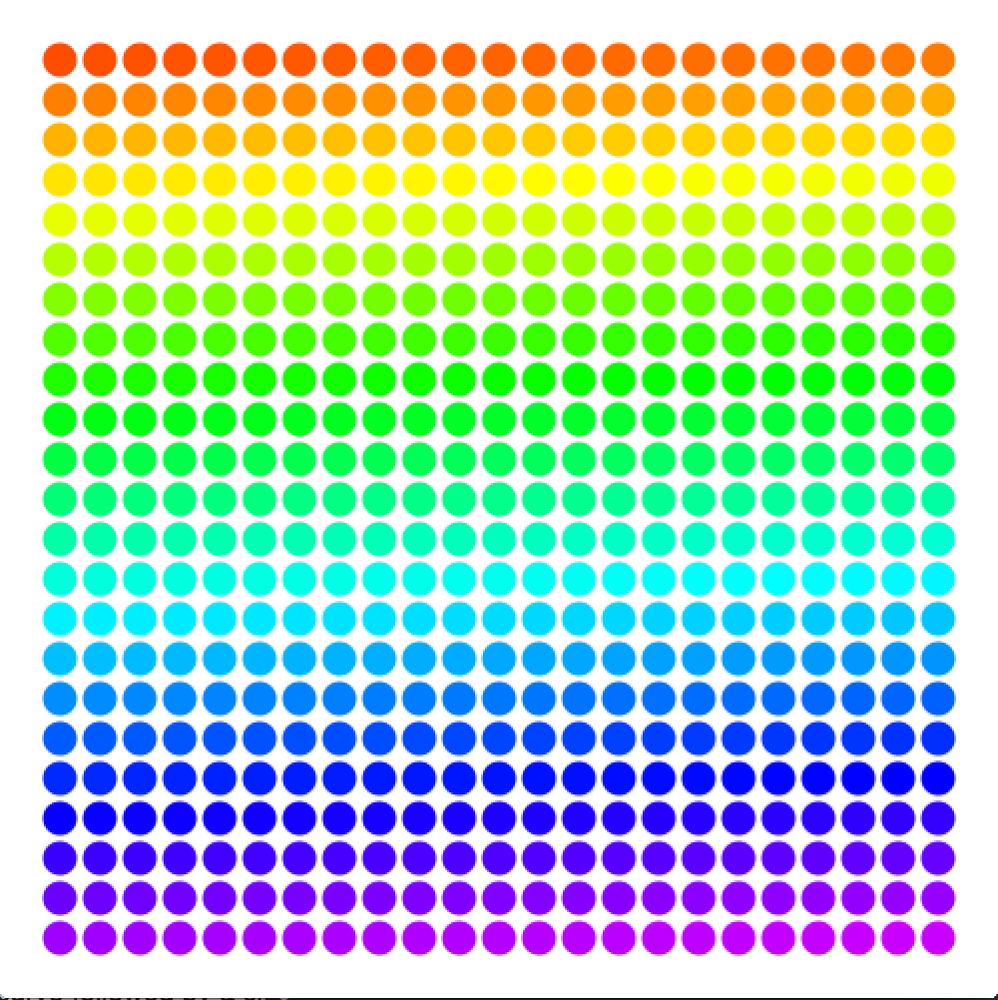

5. Circles in an triangle.

   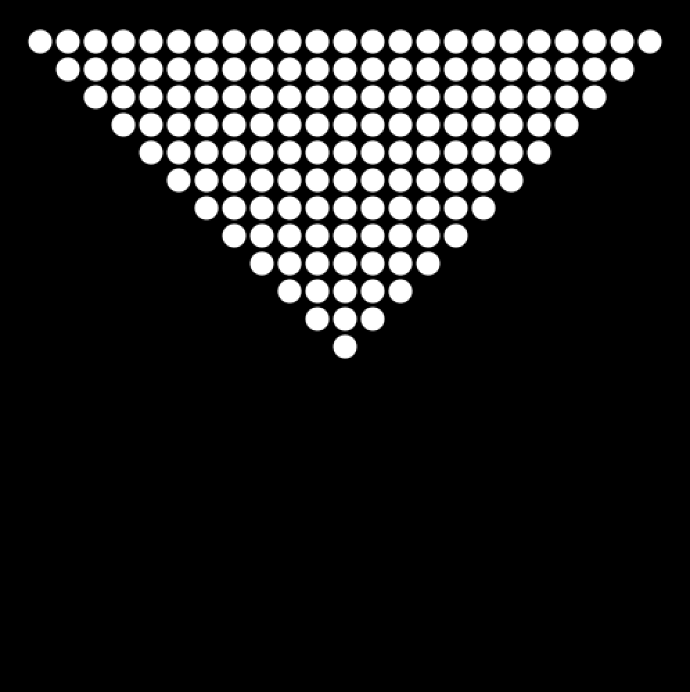
   
6. Circles in an hourglass.

   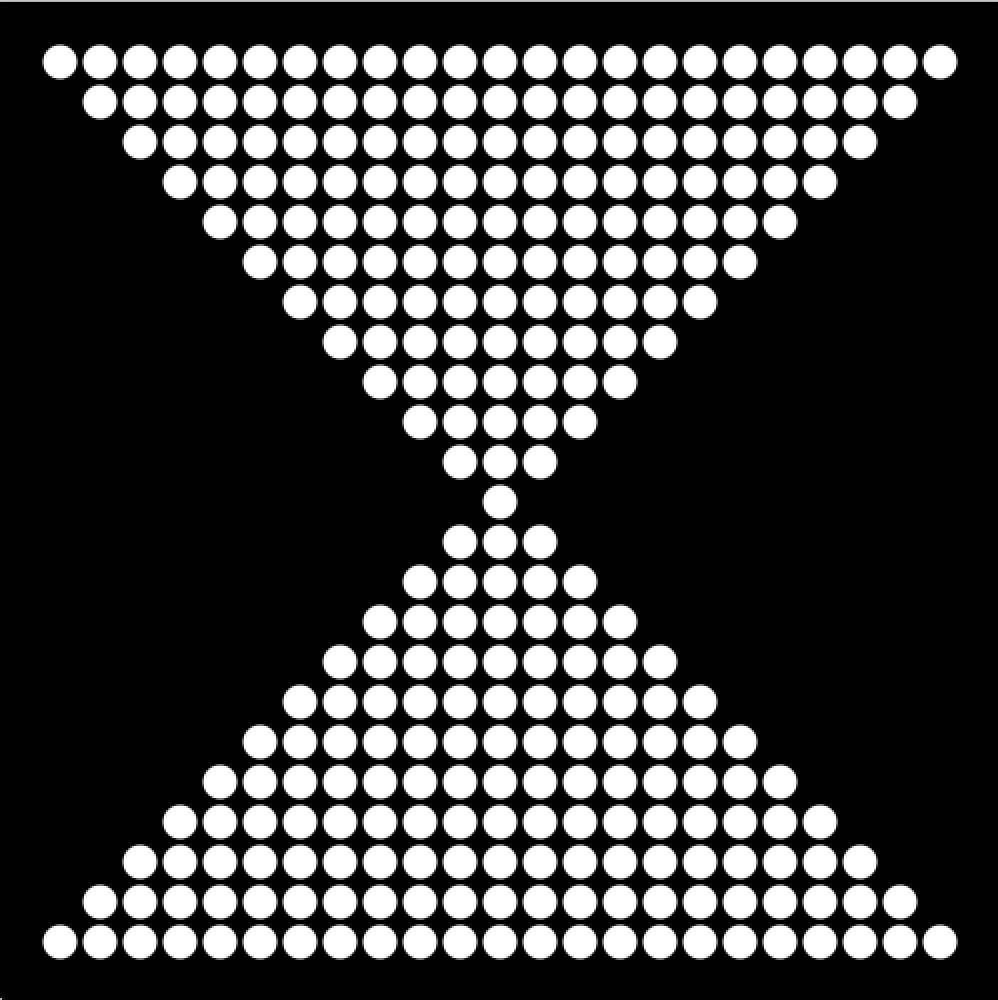

7. The grid.
   
   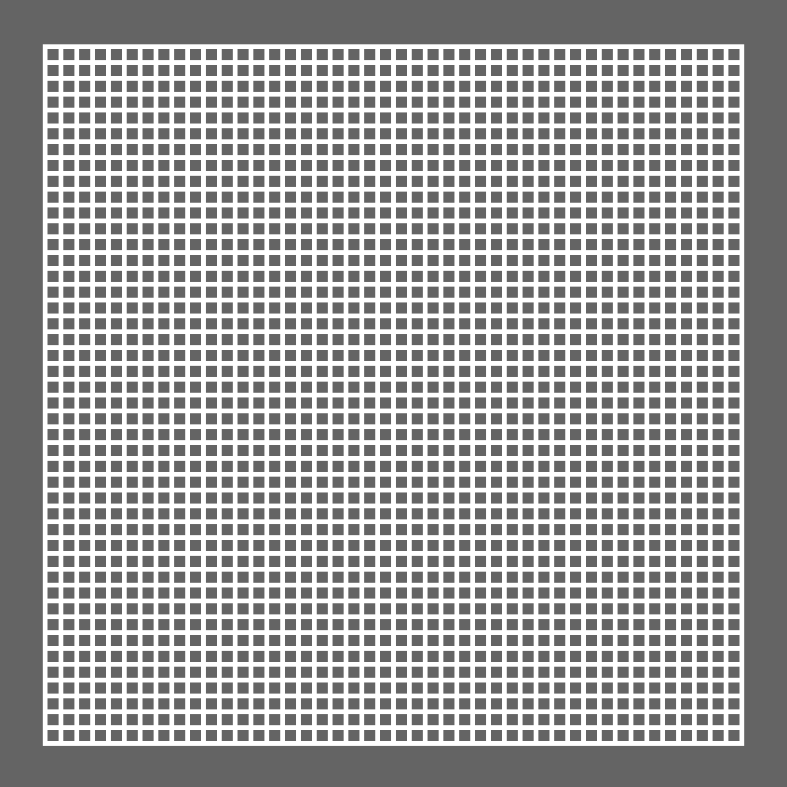
   
8. Diagonal lines.

   

9. Diagonal lines, interrupted.

   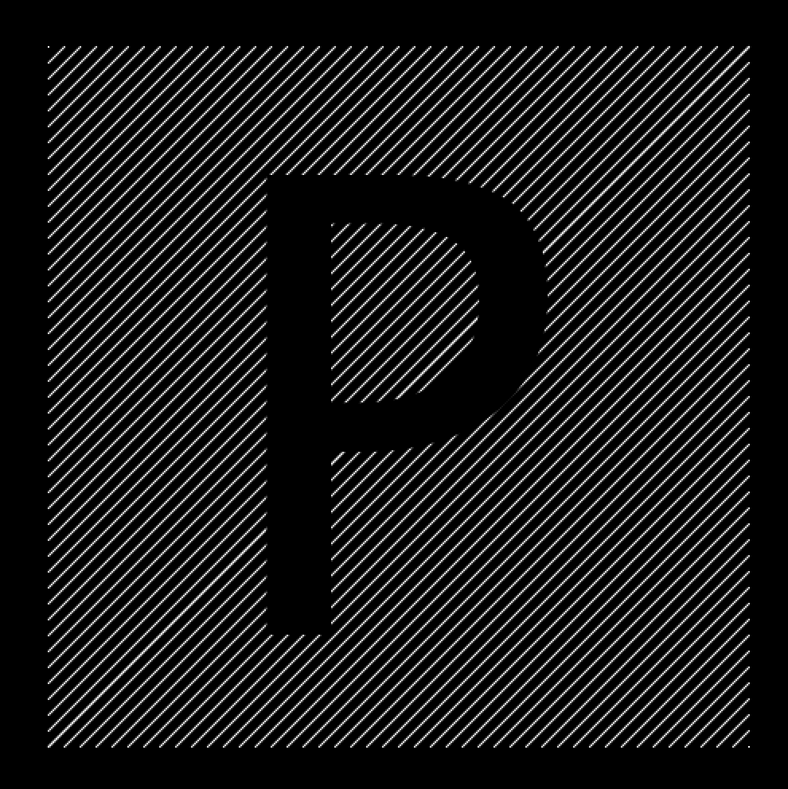

10. Random bars.

   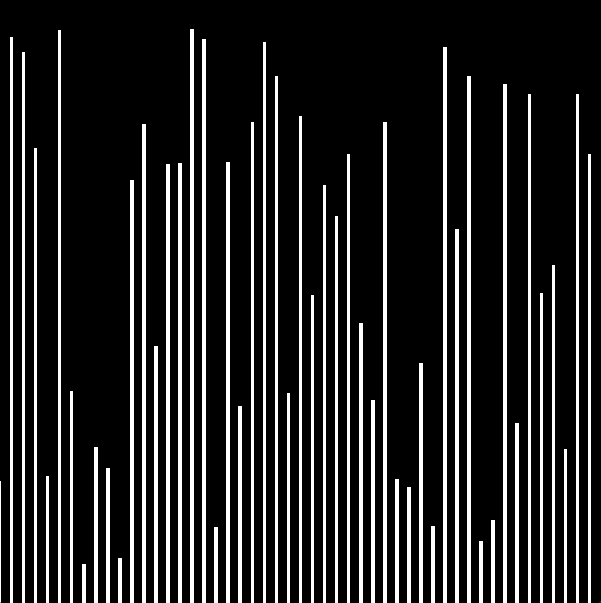

11. Random bars, animated.

   [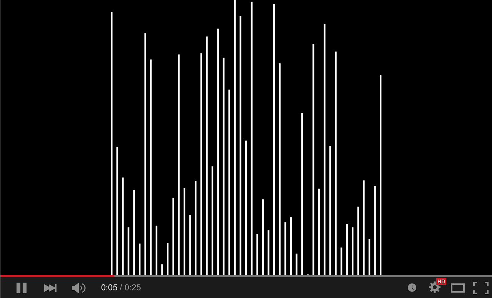](http://youtu.be/EA9MqlY56LM)

12. Animated bars, mouse-sensitive. Check out the P5.js-defined variables `mouseX` and `mouseY` in the [P5.js reference](http://p5js.org/reference).

   [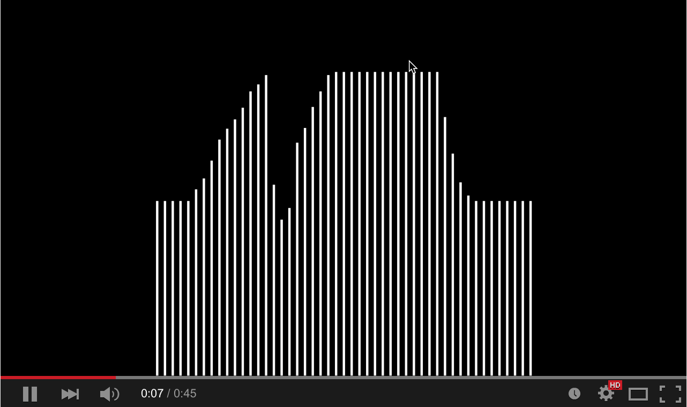](http://youtu.be/3OAKqXS5Lkw)

13. Bouncing balls, just two.

   [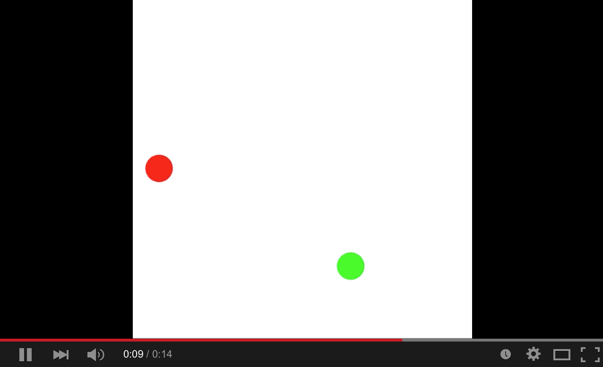](http://youtu.be/7sfC4-4VoM4)

14. **Challenge:** Bouncing balls, more added by clicking. You may need to use an `Array` or two.

   [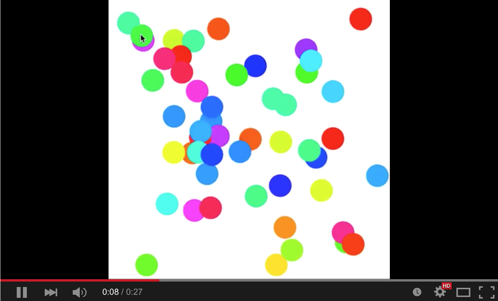](http://youtu.be/Tnkhya3Tqu0)

15. **Challenge:** Fireworks! They should track the mouse and appear on clicks.

   [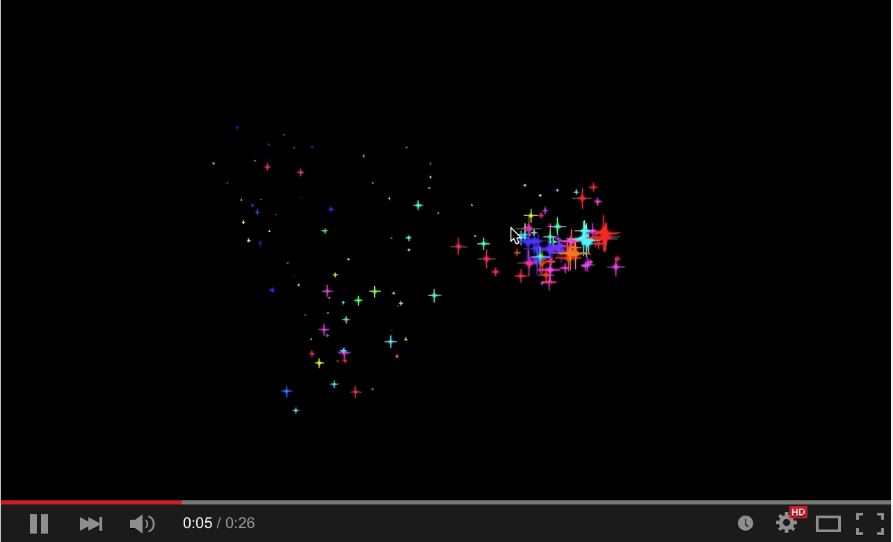](http://youtu.be/yNTUEe9cof8)
   
