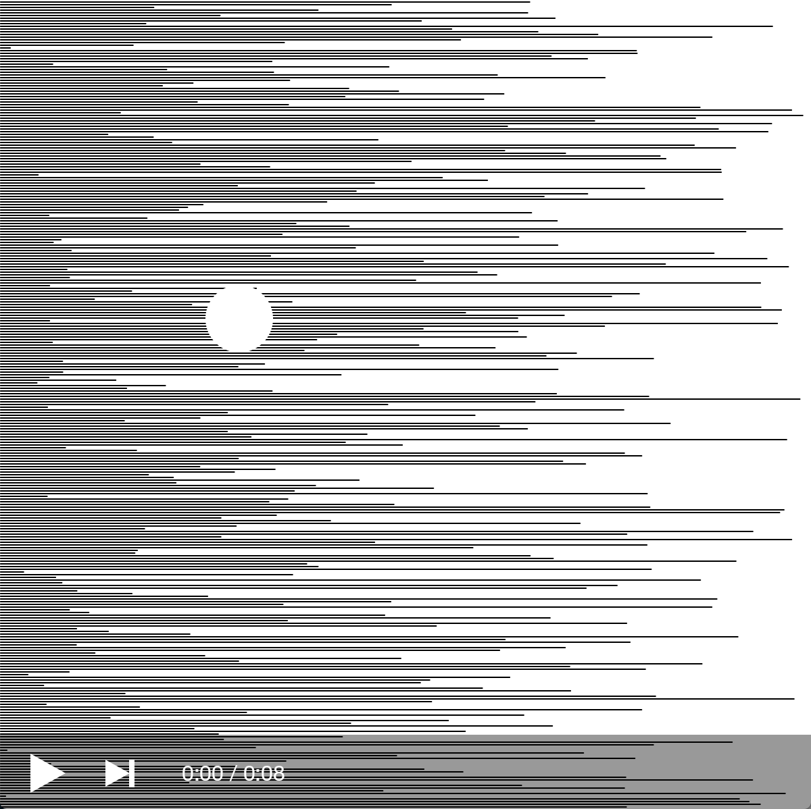
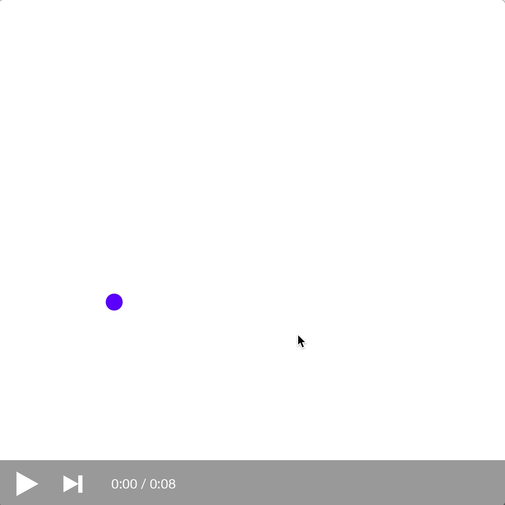

### Homework 4 (due Sunday, October 2, 2016)

This homework consists of 5 array practice problems, some of which may be quite difficult. Please [email us](mailto:jzamfirescupereira@cca.edu,mshiloh@cca.edu) if you are stuck!

#### Array Practice

1.  Starting with the following code that we wrote in class, add an additional property to each circle: `size`. Just as each circle has its own position, velocity, and color, give each circle a distinct size as well.

    You'll need another array for size, which you'll probably want to add values to in your `setup` function. Then use those values when you draw (and move!) the circles.
    

    ```javascript
    var x = [];
    var y = [];
    var vx = [];
    var vy = [];
    var c = [];

    var numCircles = 1000;

    function setup() {
      createCanvas(600, 600);
    
      colorMode(HSB);
    
      for (var i = 0; i < numCircles; i = i + 1) {
        x.push(random(width));
        y.push(random(height));
        vx.push(random(-4, 4));
        vy.push(random(-4, 4));
        c.push(color(random(360), 100, 100));
      }
    }

    function draw() {
      background(255);
      for (var i = 0; i < numCircles; i = i + 1) {
        noStroke();
        fill(c[i]);
        ellipse(x[i], y[i], 20, 20);
    
        x[i] = x[i] + vx[i];
        y[i] = y[i] + vy[i];
    
        // x+10: right edge of the circle
        if (x[i] + 10 >= width) {
          vx[i] = -abs(vx[i]);
        }
        // x-10: left edge of the circle
        if (x[i] - 10 <= 0) {
          vx[i] = abs(vx[i]);
        }
        // y+10: bottom edge of the circle
        if (y[i] + 10 >= height) {
          vy[i] = -abs(vy[i]);
        }
        // y-10: top edge of the circle
        if (y[i] - 10 <= 0) {
          vy[i] = abs(vy[i]);
        }
      }
    }
    ```
2.  Create a new sketch that draws lines of random length from the left edge of the screen, with a "spotlight" circle that follows the mouse. 

    [](https://youtu.be/baQu1JVHzXw)

    (Click the image above to view the animation.)

    The first part -- just the lines of random length -- would be pretty simple on its own with just a loop. A single `for` loop using variable `y`, starting at `0`, going up to `height`, increasing by `2` each time, with the body of the loop drawing a single line from `(0, y)` to `(random(width), y)`. Right?
    
    But the spotlight means that you want to draw the **same** random lines each time. So you need to generate and save those "random" lengths in an array (inside `setup`), then clear the canvas and redraw them each frame (inside `draw`), then draw the circle spotlight on top, positioned using `mouseX` and `mouseY`.
    
3.  Arrayification: here's a sketch with two sets of variables, one for each circle.

    Modify the sketch so that it uses arrays instaed, and has 20 circles.
    
    ```javascript
    var x1, y1, vx1, vy1;
    var x2, y2, vx2, vy2;

    function setup() {
      createCanvas(600, 600);
    
      // initialize circle 1
      x1 = random(width);
      y1 = 50;
      vx1 = random(2);
      vy1 = 0;

      // initialize circle 2
      x2 = random(width);
      y2 = 50;
      vx2 = random(2);
      vy2 = 0;
    }
    
    function draw() {
      background(255);
    
      // draw circle 1
      ellipse(x1, y1, 20, 20);
    
      // draw circle 2
      ellipse(x2, y2, 20, 20);
    
      // move circle 1
      x1 += vx1; // equivalent to x1 = x1 + vx1;
      y1 += vy1;
    
      // move circle 2
      x2 += vx2;
      y2 += vy2;
    
      // gravity circle 1
      vy1 += 0.5;
    
      // gravity circle 2
      vy2 += 0.5;
    

      // bounce circle 1
      if (x1 + 10 >= width) {
        vx1 = -abs(vx1);
      }
      if (x1 - 10 <= 0) {
        vx1 = abs(vx1);
      }
      if (y1 + 10 >= height) {
        vy1 = -abs(vy1);
        vy1 = vy1 * 0.75; // dampen -- lose some speed on every bounce!
      }
      if (y1 - 10 <= 0) {
        vy1 = abs(vy1);
      }
    
      // bounce circle 2
      if (x2 + 10 >= width) {
        vx2 = -abs(vx2);
      }
      if (x2 - 10 <= 0) {
        vx2 = abs(vx2);
      }
      if (y2 + 10 >= height) {
        vy2 = -abs(vy2);
        vy2 = vy2 * 0.75; // dampen -- lose some speed on every bounce!
      }
      if (y2 - 10 <= 0) {
        vy2 = abs(vy2);
      }
    }
    ```

4.  Take the circles-following example we wrote together in class, and modify it so that it has a chain of 10 circles, each following the previous circle, all up to the first circle that follows the mouse. 

    Use an array for those circles!
    
    Here's the code again for your reference:
    
    ```javascript
    var x, y;
    var vx, vy;

    function setup() {
      createCanvas(600, 600);
      x = width/2;
      y = height/2;
      vx = 0;
      vy = 0;
    }

    function draw() {
      background(255);
      fill("red");
      noStroke();
      ellipse(x, y, 10, 10);
    
      x = x + vx;
      y = y + vy;
    
      var d = dist(x, y, mouseX, mouseY) / 10; // turns out this line is optional! 
    
      var dx = mouseX - x;
      var dy = mouseY - y;
    
      vx = dx/10;
      vy = dy/10;
    }
    ```

5.  **Challenge** -- *please try this exercise, but it's ok if you don't finish it. Feel free to work with others on this exercise! Make sure to note your collaborators in your submitted work.*

    Starting with either the code from exercise 4 above, or the multiple-circles code from class, modify it to create the following sketch:
    
    [](https://youtu.be/PQScIqNWMAw)
    
    You'll need to use the `mousePressed()` and `mouseReleased()` functions, and probably the `mouseIsPressed` variable too. Think of what data you need to save when -- for example, you'll probably want to store the `x` and `y` coordinate of the original click in some variables.

    